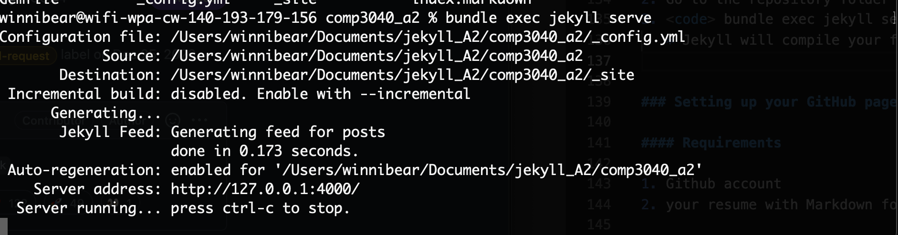
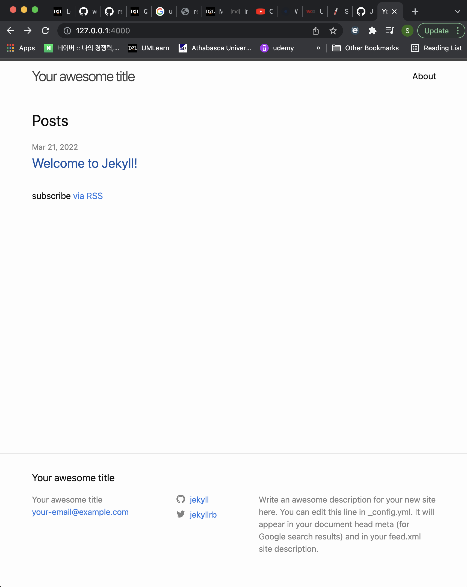
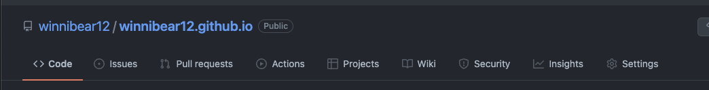
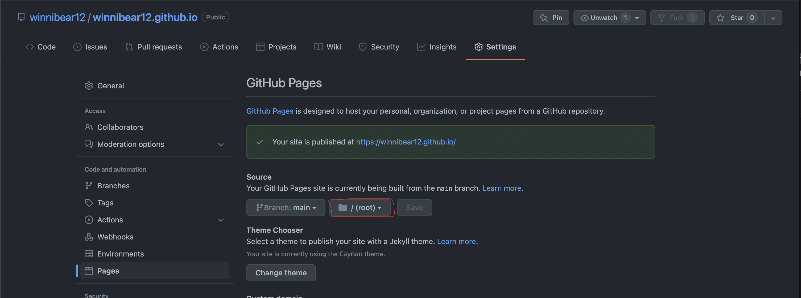
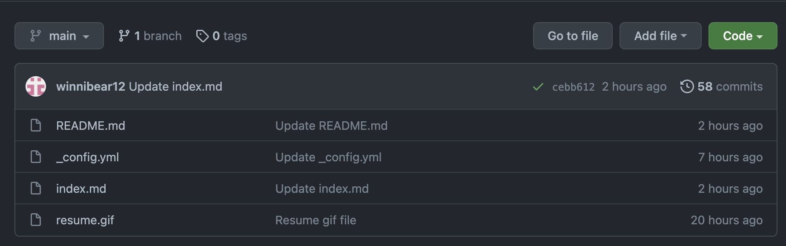
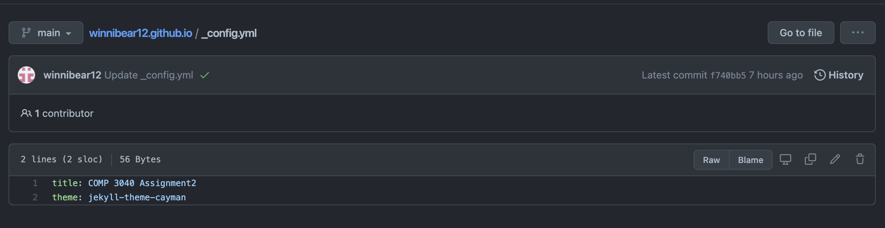

# Practical steps for hosting you resume with Markdown and Jekyll
---

### The purpose of this Readme is to give information about how to host a resume on Github pages using Jekyll to Computer Science students.  

   
---
## Prerequisites

1. Prepare your updated resume.
2. The resume must be Markdown formatted.
3. If you are not familiar to Markdown format, here is a good tutorial to learn Markdown.
   [Markdown tutorial](https://www.markdowntutorial.com/)
4. Prepare Markdown editor like Atom, iAWriter or Visual Studio code with markdown plugin.

---
## Before you start..
---

The author of [Modern Techinical Writing](https://www.amazon.ca/Modern-Technical-Writing-Introduction-Documentation-ebook/dp/B01A2QL9SS), Andrew Etter, is a documentation manager at Google. In his book (Modern Techinical Writing), He provided helpful principles when you are documenting a techinical article. I want to emphasize that this principles helped me to write this Readme file.

  **Define the Audience**

   There are roughly 3 kinds of readers:

   1. Users: People who just want to use the application.
   2. Administrators: People who install and configure applications.
   3. Developers: People who extend applications or interfaces with code.

  **Build a website**

   - Avoid distribute PDFs, and make a website instead.
   - With PDFs, you can never update them.
   - Hosting your writing can give you a ability to fix mistakes and keep your contents up-to-date.

  **Use Lightweight Markup**

  - Markdown is the most widely used markup language and it has simple syntax.
  - Github flavoured Markdown is a popular for web-based systems.

  **Use Distributed Version Control**

  - Using distributed version control tool like Github.
  - The contents will stay in sync.
  - It is useful when you collaborate the contents with others.

---
# Markdown   
---
## What is Markdown?  

In Andrew Etter's [book](https://www.amazon.ca/Modern-Technical-Writing-Introduction-Documentation-ebook/dp/B01A2QL9SS), Etter stated that Markdown is the most widely used markup language in the world.

- Markdown is a lightweight markup language to make writing for online easier. It is easier to learn and easier to convert to HTML.
- It is widely used for Github, Skype, Slack and Facebook Massenger.

## Why we use Markdown?

In Andrew Etter's [book](https://www.amazon.ca/Modern-Technical-Writing-Introduction-Documentation-ebook/dp/B01A2QL9SS), Etter wrote that markdown is lightweight, has simple syntax.

- It is easy to learn. 
  * Compared to the other language, the syntax is really simple.
- It is fast  
  * The simple syntax will save your writing process.
  * You can focus on the quality of the writing, not the shape
- It is multi-platform  
  * Markdown can be written and read on any OS and it's mobile friendly too.

  

## How do we use Markdown?  

- Here is a awesome tutorial you can follow.
  - [Markdown tutorial](https://www.markdowntutorial.com/)

- You will need a markdown editor
   [MarkdownPad](http://www.markdownpad.com/) (Windows)  
   [ReText](http://sourceforge.net/projects/retext/) (Linux)    
   [iA Writer](https://ia.net/writer) (macOS)
   [Visual Studio Code](https://code.visualstudio.com/) (Any OS)
- In this readme, we will use Visual Studio Code with **Markdown All in One** and **Markdown Preview** extension.

## Setting up your Markdown editor

1. Follow this link to download [Visual Studio Code](https://code.visualstudio.com/).
2. Click Extensions button at the left pannel.
3. Search **Markdown All in One** and **Markdown Preview** extension and download them.
4. You are ready to write a Markdown file!

---
# Github for hosting static website
---

## What is a static website

- It is a decoupled website which means every page is individual html files.
- According to the Andrew Etter's [book]((https://www.amazon.ca/Modern-Technical-Writing-Introduction-Documentation-ebook/dp/B01A2QL9SS)), Etter mentioned that static websites are no server-side application dependencies, no databases, and nothing to install, also it it migrating entire site is easier.  
       

## Why do we use static website?

In Andrew Etter's [book](https://www.amazon.ca/Modern-Technical-Writing-Introduction-Documentation-ebook/dp/B01A2QL9SS),  Etter mentioned 4 reasons why he loves static website:  
 1. Speed
 2. Simplicity
 3. Portability
 4. Security

More advantages of using static website:

- Static site can decouple your front-end and your content repository.
- It has faster loading speed than dynamic websites.
- It is easier to make a website.
- It has better security.
- It is mobile friendly.

## What static generator we will use?

In this instruction, we will use [Jekyll](http://jekyllrb.com/). Jekyll is the most popular static site generator and it is designed to make a beautiful, functional documentation website.

### Prepare your resume in Markdown format

1. We will use Github Flavored Markdown since we are hosting your resume.md on Github
2. Download if you don't have markdown editors yet  
   [MarkdownPad](http://www.markdownpad.com/) (Windows)  
   [ReText](http://sourceforge.net/projects/retext/) (Linux)    
   [iA Writer](https://ia.net/writer) (macOS)

3. If you are not familiar to Markdown format, here is a good tutorial to learn Markdown.
   [Markdown tutorial](https://www.markdowntutorial.com/)

### Install Jekyll on MacOS

1. Setup [Jekyll](http://jekyllrb.com/) to host a static website.  
   
   There is a requirements before you installing jekyll.

   - Ruby version 2.50 or higher. (Check your Ruby version) <code> ruby -v </code> 
   - RubyGems <code> gem -v </code>
   - GCC & Make <code>gcc -v </code> <code>make -v </code>
  
2. Setup Command line tools  
   - open a terminal run this command
   
        <pre><code>xcode-select --install </code></pre>

3. Install Ruby  
  
   
   You will need to install **Homebrew** to install Ruby on MacOs.  
   <pre><code> /bin/bash -c "$(curl -fsSL https://raw.githubusercontent.com/Homebrew/install/HEAD/install.sh)"</code></pre>  

   **If you are using a M1, M1 pro, M1 max chip, then follow click [here](#FAQs) to follow this step**

   then, run this command to install Ruby  
   <pre><code> brew install ruby </code></pre>

   Restart the terminal and check the Ruby status

   <pre><code> which ruby </code></pre>
   <pre><code> ruby -v </code></pre>  

4. Install Jekyll  
   
   Finally, we can install the Jekyll.  

   <pre><code> gem install --user-install bundler jekyll </code></pre>

### Creating a site

1. <code> jekyll new blog_name </code>
   * Jekyll will make a basic website for us with this command.

2. Go to your website folder that you just created in your terminal
3. <code> bundle exec jekyll serve </code>
   * Jekyll will compile your files to a website.
   * **If you have a error called "cannot load such file webrick (LoadError)", then run** <code>bunle add webrick </code> **to install missing bundle** 
   [Refer to this page](https://github.com/jekyll/jekyll/issues/8523) 
4. Check your server address 
   * example) Server address: 123.0.0.1:7000/
   

5. Check your website on the browser!
   

   
   

### Setting up your GitHub page  

#### Requirements

1. Github account
2. your resume with Markdown format

#### Follow this step (talk aboht more readme)

1. Make a repository named [Github username].github.io
   [Follow this page to setup](https://kbroman.org/github_tutorial/pages/init.html)

   
2. Under the repository(root), make a upload or write a resume (foramtted with markdown) file.
   File name should be "index" and format should be .md .  
   
   

3. upload a README markdown file.
   
   
4. Under settings, enable Github pages.
   
   
5. Edit _config.yml. 
   
    

   <pre><code> title: Resume </code></pre>
   <pre><code> theme: jekyll-theme-cayman </code></pre>

6. Check your Github page follow: "your_username.github.io"
   
    

7. Now you hosted your resume on Github!

   

---
# More resources
---

1. [Markdown tutorial](https://www.markdowntutorial.com/) 
2. [Modern Technical Writing: An Introduction to Software Documentation](https://www.amazon.ca/Modern-Technical-Writing-Introduction-Documentation-ebook/dp/B01A2QL9SS)
3. [Mike Dane's Jekyll tutorial](https://www.youtube.com/watch?v=T1itpPvFWHI&list=PLLAZ4kZ9dFpOPV5C5Ay0pHaa0RJFhcmcB)

---
# FAQs
---
## Why do we use static website?
   
   
   According to the Andrew Etter's [book]((https://www.amazon.ca/Modern-Technical-Writing-Introduction-Documentation-ebook/dp/B01A2QL9SS)), Etter mentioned that static websites are no server-side application dependencies, no databases, and nothing to install, also it it migrating entire site is easier.  
     

## I am using apple M1 processor and I am having trouble with jekyll.

- This might be a problem with the pre-installed Ruby version with Mac.
- We need to re-install the Ruby with 3.0 version
  
  1. <code> export SDKROOT=$(xcrun --show-sdk-path) </code>
      * after running this command, there should be no errors

  2. <code> ruby -v </code>
      * macOS are all pre-installed the Ruby and the pre-installed versions can not be used, so we need to install Ruby 3.x version manually.

  3. <code> brew install ruby@3.0 </code> 
      * install Ruby 3.0

  4. <code> echo 'export PATH="/opt/homebrew/opt/ruby/bin:$PATH"' >> ~/.zshrc </code>
      * run this command to Ruby in the first in path

  5. close the terminal and reopen it
  6. <code> ruby -v </code>
      * check if ruby version is changed to 3.x

---
# Authors and Acknowledgements
---
Thanks to Jason Long for providing cayman theme on Github pages.

I thank to Andrew Etter who wrote "Modern Technical Writing: An Introduction to Software Documentation" for providing quality contents of how to write techinical documents.

Special thanks to my group 7 from COMP3040 class.
